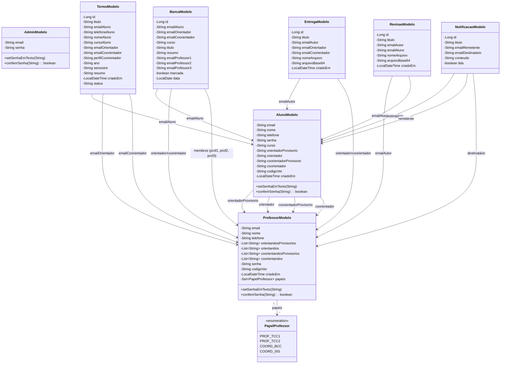

# TCC Online: um sistema de gerenciamento da disciplina TCC I no DSC da FURB

Este repositório contém o código do TCCOn, um sistema de gerenciamento de TCCs que eu desenvolvi durante o ano de 2025 como o meu trabalho de conclusão do curso de ciência da computação na FURB, sob a orientação do [@dalton-reis](https://github.com/dalton-reis). O TCCOn foi projetado para ajudar os professores e alunos do departamento a lidar com a comunicação e a troca de documentos exigidas pela disciplina TCC I.

## A _stack_ escolhida

- Servidor (_back-end_): Spring Boot. A minha implementação usa quatro camadas: modelo, para estruturas de dados; controle, para funções CRUD; serviço, para regras de negócio; e repositório, para chamadas ao banco de dados;  
- Cliente (_front-end_): HTML e JavaScript simples. As páginas sãao geradas estaticamente e as entradas do usuário disparam chamadas ao servidor. O CSS foi emprestado do Bootstrap;  
- Banco de dados: MariaDB, uma escolha simples, sólida e com licença livre, perfeita para pequenos projetos como o TCCOn.

## Diagrama MER

Abaixo está o modelo entidade-relacionamento do TCCOn, renderizado pela ferramenta Mermaid.

